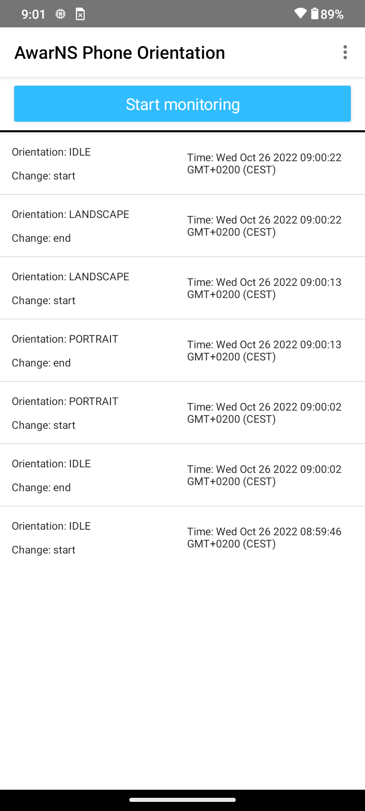
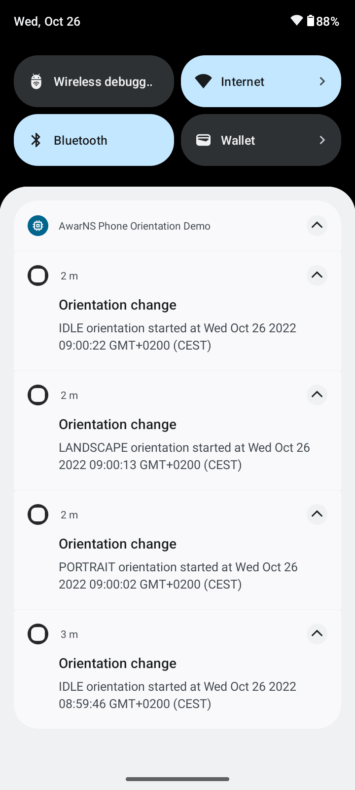

# AwarNS Phone Orientation

This application is a demo that uses some of the features provided by the [AwarNS Framework](https://github.com/GeoTecINIT/awarns-framework).

The application allows to start and stop monitoring the orientation changes of the smartphone.
When a orientation change is detected, a notification is triggered to warn the user. In addition, the orientation changes
are shown in the application main view.

## Overview
This demo application monitors the orientation changes of the smartphone using the accelerometer data of its embedded IMU.
Accelerometer data is collected using [@awarns/phone-sensors](https://github.com/GeoTecINIT/awarns-framework/tree/main/packages/phone-sensors).

The detected changes are the following ones:
- Portrait
- Landscape
- IDLE (i.e., phone resting on a table).

When a detected orientation is different from a previous one, the application warns the user with a notification.
To keep track of the detected orientations, [@awarns/persistence](https://github.com/GeoTecINIT/awarns-framework/tree/main/packages/persistence) is used.
In order to trigger notifications to warn the user, [@awarns/notifications](https://github.com/GeoTecINIT/awarns-framework/tree/main/packages/notifications) is used.

### Domain specific features
With these AwarNS features, the only thing that had to be implemented was the orientation change detection (i.e., domain specific behaviour).
This resulted in the following steps:
- Create a domain specific [orientation record](app/core/orientation.ts) extending the AwarNS Record class.
In this way, the record can be used as any other AwarNS Record by other features (e.g., persistence).
- Create a domain specific [orientation checker task](app/core/orientation-status-checker.ts) extending the AwarNS Task class.
This task receives accelerometer samples from an *@awarns/phone-sensors* task, processes them to determine the orientation of the smartphone, and emits
a domain orientation record.
- Create a utility task to [build the notification body text](app/core/prepare-notification-task.ts) from an orientation record, to be used
in the triggered notifications.

The result of the domain specific tasks and the AwarNS provided tasks can be seen in the following task graph:
```typescript
class AwarNSPhoneOrientationTaskGraph implements TaskGraph {
  async describe(
    on: EventListenerGenerator,
    run: RunnableTaskDescriptor
  ): Promise<void> {
    on(
      'startMonitoring',                             // Domain-specific event
      run('startDetectingPhoneAccelerometerChanges') // @awarns/phone-sensors
    );

    on(
      'accelerometerSamplesAcquired',                // @awarns/phone-sensors
      run('orientationStatusCheckerTask')            // Domain-specific task
    );
    on(
      'orientationChangeDetected',                   // Domain-specific event
      run('writeRecords')                            // @awarns/persistence
    );
    on(
      'orientationChangeDetected',                   // Domain-specific event
      run('prepareNotificationTask')                 // Domain-specific task
    );
    on(
      'notificationPrepared',                        // Domain-specific event
      run('sendNotification', {                      // @awarns/notifications
        title: 'Orientation change'
      })
    );

    on(
      'stopMonitoring',                              // Domain-specific event
      run('stopDetectingPhoneAccelerometerChanges')  // @awarns/phone-sensors
    );
  }
}
```

## Requirements

- The application and the AwarNS Framework have been developed using [NativeScript](https://nativescript.org). Therefore, NativeScript has to installed
in your system. To install NativeScript, follow the [instructions](https://docs.nativescript.org/environment-setup.html) on their website.
- The application is only supported by API 21+ Android smartphones.


## Installation

Clone this repository with the following instruction:

```bash
git clone https://github.com/matey97/awarns-phone-orientation.git
```

Then, install its dependencies:

```bash
npm install
```

Finally, connect an Android smartphone to with [USB debugging enabled](https://developer.android.com/studio/debug/dev-options)
or start an Android emulator and install the application:

```bash
ns run android
```

### Screenshots





## License

Apache License Version 2.0.

See [LICENSE](LICENSE).
